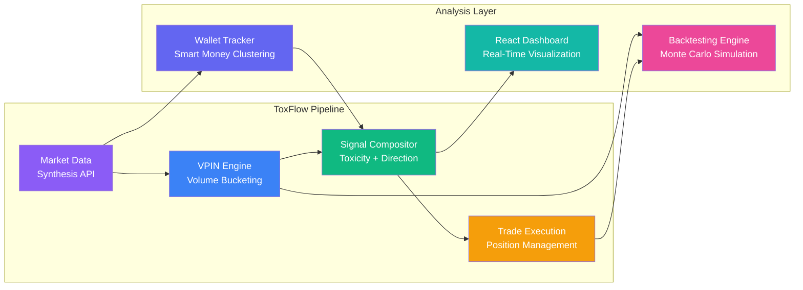
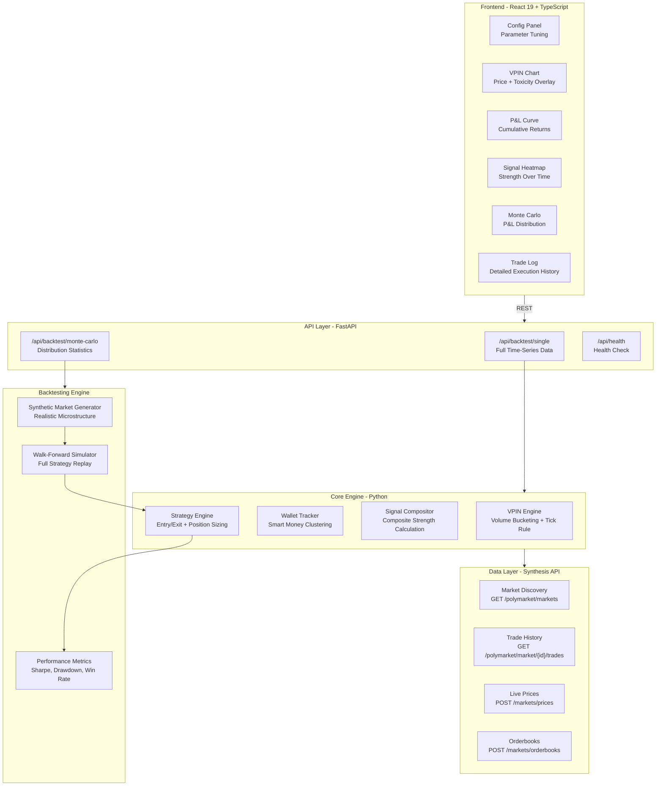
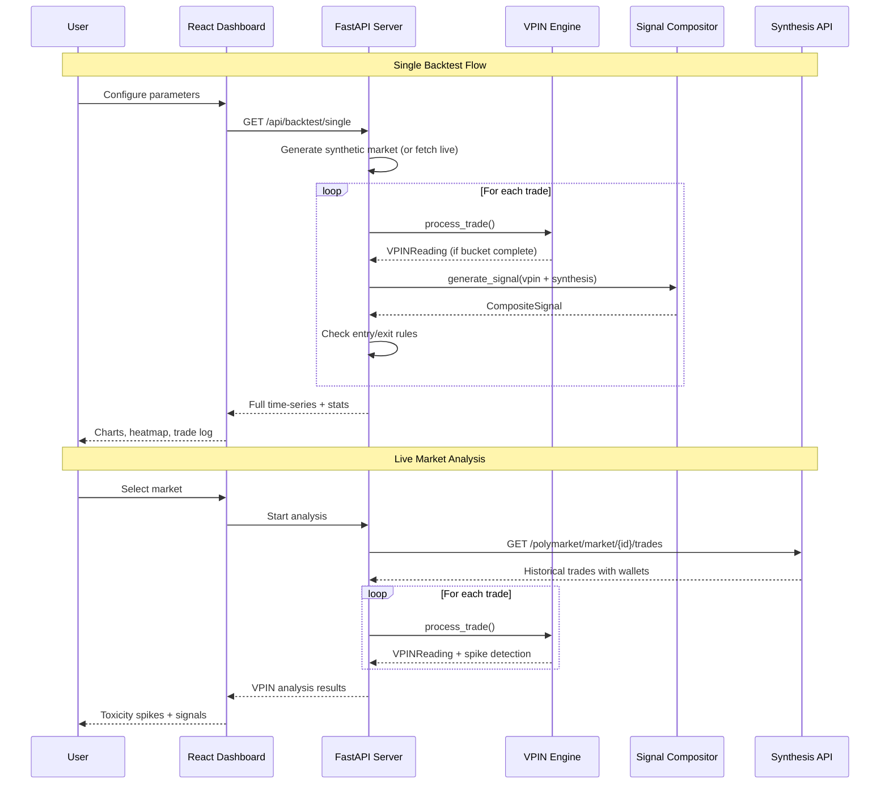

# ToxFlow — Polymarket Orderflow Toxicity Engine

[](https://www.python.org/downloads/)
[](https://fastapi.tiangolo.com/)
[](https://synthesis.trade)
[](https://react.dev/)
[](https://opensource.org/licenses/MIT)

> **Orderflow 001 Hackathon Submission** · Track: AI-Augmented Systems + Quantitative Trading

**Detect when smart money enters a prediction market — and trade in their direction.**

## Quick Highlights

- **VPIN Engine**: Volume-Synchronized Probability of Informed Trading adapted for binary outcome markets — first-ever application to prediction markets
- **Directional VPIN**: Novel extension that reveals *which side* (YES/NO) informed flow favors, not just *that* it's present
- **Synthesis Overlay**: Real-time Polymarket data via Synthesis API confirms VPIN signals with market intelligence
- **Composite Signals**: Toxicity + direction + Synthesis edge combined into a single actionable trade signal
- **Smart Money Tracking**: Wallet clustering identifies historically accurate traders and weights their flow
- **Monte Carlo Backtesting**: Statistical confidence via 100+ simulated markets with full performance metrics
- **Live Dashboard**: React frontend with VPIN charts, P&L curves, signal heatmaps, and trade logs

## The Problem

Every Polymarket bot on GitHub is doing the same thing — latency arbitrage, copy trading, or simple sentiment analysis. Meanwhile, **institutional market makers** have been using orderflow toxicity analysis for over a decade to detect informed traders in equity markets.

| Current Approach | Why It Fails |
|---|---|
| Copy trading top wallets | Wallets can be gamed, signals are delayed |
| Sentiment analysis | Lagging indicator, doesn't capture real money flow |
| Latency arbitrage | Race to zero, no sustainable edge |
| Simple price momentum | Ignores *who* is trading and *how aggressively* |

**Nobody has brought market microstructure analysis to prediction markets.** ToxFlow applies the same institutional quant framework (VPIN) that detected the 2010 Flash Crash — to Polymarket.

## The Solution

ToxFlow measures **orderflow toxicity** — the probability that incoming trades are from informed participants who know something the market doesn't yet reflect.

### How It Works

1. **Volume Bucketing**: Instead of time bars, trades are grouped by volume ($100 USDC per bucket). This normalizes for prediction market burstiness.

2. **Trade Classification**: Each bucket's buy/sell imbalance is computed using the tick rule (price movement direction).

3. **VPIN Calculation**: Rolling window measures how one-sided the flow is:
   ```
   VPIN = (1/N) x SUM |V_buy(i) - V_sell(i)| / V_total(i)
   ```
   High VPIN = one side is aggressively consuming liquidity = informed traders are active.

4. **Directional VPIN** (our innovation): Signed variant reveals the *direction* of informed flow:
   ```
   D-VPIN = (1/N) x SUM (V_buy(i) - V_sell(i)) / V_total(i)
   ```
   Positive = smart money buying YES. Negative = smart money buying NO.

5. **Composite Signal**: VPIN toxicity + Synthesis market data combined with agreement/disagreement multipliers to generate trade decisions.

## High-Level Workflow



### Signal Generation Pipeline

| Stage | Component | Input | Output |
|-------|-----------|-------|--------|
| **Ingest** | Synthesis Client | Polymarket condition ID | Raw trades with wallet addresses |
| **Bucket** | VPIN Engine | Stream of trades | Volume-synchronized buckets with buy/sell imbalance |
| **Measure** | VPIN Calculator | Rolling bucket window | VPIN value (0-1) + Directional VPIN (-1 to +1) |
| **Detect** | Spike Detector | VPIN + EMA baseline | Z-score spike alerts when toxicity exceeds threshold |
| **Compose** | Signal Compositor | VPIN + Synthesis data | Composite signal strength + recommended side + position size |
| **Execute** | Strategy Engine | Composite signal | Entry/exit decisions with profit targets and stop losses |

## Architecture & Technical Overview

### System Architecture



### Data Pipeline



### Technical Deep Dive

#### VPIN Engine (`core/vpin.py`)

The core innovation — VPIN adapted from Easley, Lopez de Prado & O'Hara (2012) for binary outcome markets:

| Component | Method | Purpose |
|-----------|--------|---------|
| `process_trade()` | Trade classification + bucket accumulation | Classifies trades via tick rule, fills volume buckets |
| `_complete_bucket()` | Bucket finalization with overflow handling | Splits excess volume proportionally into next bucket |
| `_compute_vpin()` | Rolling window VPIN + Directional VPIN | Computes both magnitude and direction of informed flow |
| `_update_ema()` | Exponential moving average baseline | Tracks "normal" VPIN level for spike detection |
| `is_spike()` | Z-score based spike detection | Identifies statistically significant toxicity spikes |

**Key adaptation for prediction markets**: Volume bucketing in USDC notional instead of shares, binary outcome classification (YES/NO), and directional variant for side detection.

#### Signal Compositor (`core/signal_compositor.py`)

Combines VPIN toxicity with market data into actionable signals:

```
Composite Strength = (
    0.50 x toxicity_score +
    0.25 x vpin_direction_magnitude +
    0.25 x synthesis_edge
) x direction_agreement_multiplier

Agreement multiplier:
  VPIN direction matches market edge  -> 2.0x (high confidence)
  VPIN direction opposes market edge  -> 0.3x (reduced confidence)
```

#### Wallet Tracker (`core/wallet_tracker.py`)

Clusters wallets by historical prediction accuracy:

- Tracks all wallets across resolved markets
- Scores accuracy = correct predictions / total trades
- Smart money threshold: 60%+ accuracy with 10+ trades
- Weights VPIN contribution: smart money trades get 2-5x multiplier

#### Strategy Engine (`strategies/toxicity_momentum.py`)

Full position management with multiple exit rules:

| Rule | Trigger | Default |
|------|---------|---------|
| **Profit target** | P&L exceeds threshold | 12% |
| **Stop loss** | P&L drops below threshold | -4% |
| **Time exit** | Position held too long | 600 seconds |
| **VPIN reversal** | Toxicity drops 50% below entry | Dynamic |
| **Position sizing** | Signal strength scaled | 3-8% of capital |

#### Synthesis Integration (`data/synthesis_client.py`)

Real Polymarket data via Synthesis unified API — no auth required for market data:

| Endpoint | Data | Purpose |
|----------|------|---------|
| `GET /polymarket/markets` | Market discovery | Find active high-volume markets |
| `GET /polymarket/market/{id}/trades` | Trade history with wallets | Feed VPIN engine + wallet tracker |
| `POST /markets/prices` | Live prices (batch) | Current market state |
| `POST /markets/orderbooks` | Orderbook depth | Liquidity analysis |
| `GET /polymarket/market/{id}/price-history` | OHLC candles | Historical context |

## Synthesis API Usage

| Feature | How ToxFlow Uses It |
|---|---|
| **Market Discovery** | Fetches top Polymarket markets by volume, filters by tags/search |
| **Trade History** | Pulls trade-by-trade data with wallet addresses for VPIN computation and smart money tracking |
| **Live Prices** | Batch price queries for real-time market state during analysis |
| **Orderbooks** | Depth analysis for liquidity metrics and spread computation |
| **Price History** | OHLC data for historical context and backtesting validation |
| **WebSocket Trades** | Real-time trade stream for live VPIN monitoring (wss://synthesis.trade/api/v1/trades/ws) |

## API Endpoints

| Method | Endpoint | Description |
|--------|----------|-------------|
| `GET` | `/api/backtest/single` | Run single backtest with full time-series data |
| `GET` | `/api/backtest/monte-carlo` | Run Monte Carlo simulation (N markets) |
| `GET` | `/api/health` | Health check |

### Query Parameters

| Parameter | Default | Description |
|-----------|---------|-------------|
| `duration` | 3600 | Market duration in seconds |
| `bucket_volume` | 100 | USDC per volume bucket |
| `vpin_window` | 30 | Rolling window size (buckets) |
| `z_threshold` | 0.5 | VPIN z-score threshold for signals |
| `capital` | 10000 | Initial capital ($) |
| `seed` | 42 | Random seed for reproducibility |
| `use_synthesis` | true | Enable Synthesis overlay |
| `simulations` | 100 | Monte Carlo simulation count |

## Quick Start

### Prerequisites

- Python 3.11+
- Node.js 18+
- uv (Python package manager)

### Setup

```bash
# Clone
git clone https://github.com/ankitlade12/ToxFlow.git
cd ToxFlow

# Install backend dependencies
uv sync

# Configure credentials (optional — market data works without auth)
cp .env.example .env
```

### Run

```bash
# Start API server
uv run toxflow-api

# Start frontend (separate terminal)
cd frontend && npm install && npm run dev
```

### Demo

Open **http://localhost:3000** (frontend) · API docs at **http://localhost:8000/docs**

| Step | Action | What You'll See |
|------|--------|----------------|
| **1** | Click **Run Backtest** | VPIN chart overlaid on price, cumulative P&L, signal heatmap, trade log |
| **2** | Adjust VPIN parameters | Change bucket volume, window size, z-threshold — see how signals change |
| **3** | Click **Monte Carlo** | P&L distribution across 100 simulated markets with summary statistics |
| **4** | Run live analysis | `uv run toxflow-live` — VPIN on real Polymarket trades via Synthesis |

### CLI Commands

```bash
# Run unit tests (6/6 pass)
uv run python -m toxflow.tests.test_vpin

# Single backtest on synthetic market
uv run toxflow-backtest --mode single --duration 3600

# Monte Carlo simulation (100 markets)
uv run toxflow-backtest --mode monte_carlo --simulations 100

# Live analysis on real Polymarket data
uv run toxflow-live --limit 10 --analyze-top 3

# Live analysis on a specific market
uv run toxflow-live --condition-id 0xabc123...

# Start API server
uv run toxflow-api
```

## Project Structure

```
ToxFlow/
├── toxflow/
│   ├── core/
│   │   ├── vpin.py                # VPIN engine (volume bucketing + calculation)
│   │   ├── signal_compositor.py   # Combines VPIN + Synthesis into trade signals
│   │   ├── wallet_tracker.py      # Smart money wallet clustering
│   │   └── types.py               # Shared data types (Trade, VPINReading, etc.)
│   ├── data/
│   │   ├── polymarket_client.py   # Polymarket data via Synthesis API
│   │   └── synthesis_client.py    # Synthesis unified API client
│   ├── strategies/
│   │   └── toxicity_momentum.py   # Primary strategy: trade VPIN spikes
│   ├── backtesting/
│   │   └── engine.py              # Walk-forward + Monte Carlo backtesting
│   ├── api/
│   │   └── server.py              # FastAPI endpoints for dashboard
│   ├── scripts/
│   │   ├── run_backtest.py        # CLI: backtest runner
│   │   └── run_live.py            # CLI: live market analysis
│   └── tests/
│       └── test_vpin.py           # 6 unit tests for VPIN engine
├── frontend/
│   ├── src/
│   │   ├── App.tsx                # Main dashboard layout
│   │   ├── components/
│   │   │   ├── VPINChart.tsx      # VPIN + price overlay chart
│   │   │   ├── PnlChart.tsx       # Cumulative P&L curve
│   │   │   ├── SignalHeatmap.tsx   # Signal strength scatter plot
│   │   │   ├── MonteCarloChart.tsx # P&L distribution histogram
│   │   │   ├── StatsCards.tsx      # Key performance metrics
│   │   │   ├── TradeTable.tsx      # Trade execution log
│   │   │   └── ConfigPanel.tsx     # Parameter tuning controls
│   │   └── lib/
│   │       ├── api.ts             # API client
│   │       └── types.ts           # TypeScript types
│   ├── package.json
│   └── vite.config.ts
├── pyproject.toml                 # uv project config
├── .env.example                   # Environment template
└── LICENSE                        # MIT
```

## What Makes This Novel

| # | Innovation | Why It Matters |
|---|-----------|---------------|
| 1 | **VPIN on prediction markets** | First-ever application — nobody on GitHub, academic papers, or crypto forums has done this |
| 2 | **Directional VPIN** | Standard VPIN only measures magnitude; our extension reveals *which side* smart money is on |
| 3 | **Composite signal model** | Neither VPIN nor market data alone is reliable; combining them with agreement multipliers filters false positives |
| 4 | **Volume bucketing for binary markets** | Prediction markets are bursty — volume-synchronized analysis normalizes this naturally |
| 5 | **Wallet accuracy clustering** | Weights VPIN by historically correct wallets, amplifying true informed flow signal |
| 6 | **Monte Carlo validation** | Statistical confidence across 100+ simulated markets, not just cherry-picked results |
| 7 | **Real data via Synthesis API** | Live Polymarket trades with wallet addresses — not simulated, not delayed |
| 8 | **Academically grounded** | Based on Easley, Lopez de Prado & O'Hara (2012) — the paper that detected the Flash Crash |

## Measurable Output

### Backtest Metrics (per run)

| Metric | Description |
|--------|-------------|
| **Total P&L** | Net profit/loss including transaction fees |
| **Win Rate** | Percentage of profitable trades |
| **Profit Factor** | Gross wins / gross losses |
| **Sharpe Ratio** | Risk-adjusted returns (annualized) |
| **Max Drawdown** | Largest peak-to-trough decline |
| **Total Fees** | Cumulative transaction costs (1% taker fee) |

### Monte Carlo Summary (across N simulations)

| Metric | Description |
|--------|-------------|
| **Mean/Median P&L** | Central tendency of strategy returns |
| **5th/95th Percentile** | Tail risk and upside bounds |
| **Profitable Runs %** | How often the strategy makes money |
| **Mean Sharpe** | Average risk-adjusted performance |
| **Mean Drawdown** | Average worst-case decline |

### Live Analysis Output

| Metric | Description |
|--------|-------------|
| **VPIN Readings** | Number of volume-synchronized measurements |
| **Spikes Detected** | Statistically significant toxicity events |
| **Trade Signals** | Composite signals exceeding threshold |
| **Latest VPIN** | Current toxicity level (0-1) |
| **Latest D-VPIN** | Current directional bias (-1 to +1) |

## Tech Stack

| Layer | Technology | Purpose |
|-------|-----------|---------|
| **Core Engine** | Python 3.11, NumPy | VPIN computation, signal generation, backtesting |
| **Data Layer** | Synthesis API, httpx | Polymarket market data, trades, orderbooks |
| **Backend** | FastAPI, Uvicorn | REST API serving backtest data to dashboard |
| **Frontend** | React 19, TypeScript, Recharts | Interactive charts, parameter tuning, trade visualization |
| **Styling** | Tailwind CSS v4 | Dark-themed dashboard UI |
| **Package Management** | uv, Hatchling | Python dependency management and build |
| **Telephony** | WebSocket (Synthesis) | Real-time trade streaming |

## Environment Variables

| Variable | Required | Description |
|----------|----------|-------------|
| `SYNTHESIS_PROJECT_API_KEY` | No | Synthesis project API key (market data works without auth) |
| `SYNTHESIS_ACCOUNT_API_KEY` | No | Synthesis account API key (for trading endpoints) |
| `POLYMARKET_API_KEY` | No | Direct Polymarket CLOB access (optional) |
| `TOXFLOW_HOST` | No | API server host (default: 0.0.0.0) |
| `TOXFLOW_PORT` | No | API server port (default: 8000) |

## References

1. Easley, D., Lopez de Prado, M., & O'Hara, M. (2012). "Flow Toxicity and Liquidity in a High-Frequency World." *Review of Financial Studies*, 25(5), 1457-1493.

2. Easley, D., Lopez de Prado, M., & O'Hara, M. (2011). "The Microstructure of the Flash Crash: Flow Toxicity, Liquidity Crashes, and the Probability of Informed Trading." *Journal of Portfolio Management*, 37(2), 118-128.

3. Synthesis Trade API — https://synthesis.trade

## License

MIT License — see [LICENSE](LICENSE) file for details.

---

**Built for the Orderflow 001 Hackathon.** *Bringing institutional market microstructure analysis to prediction markets.*
